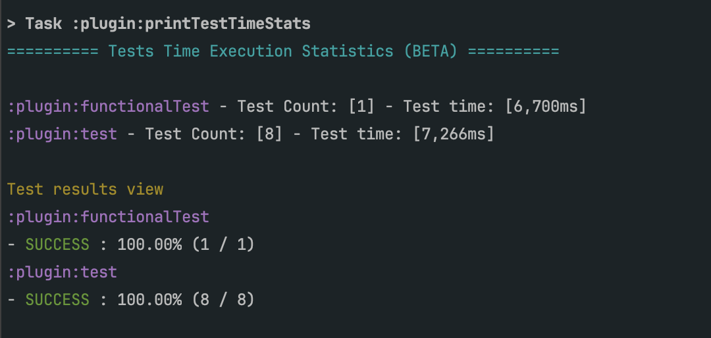
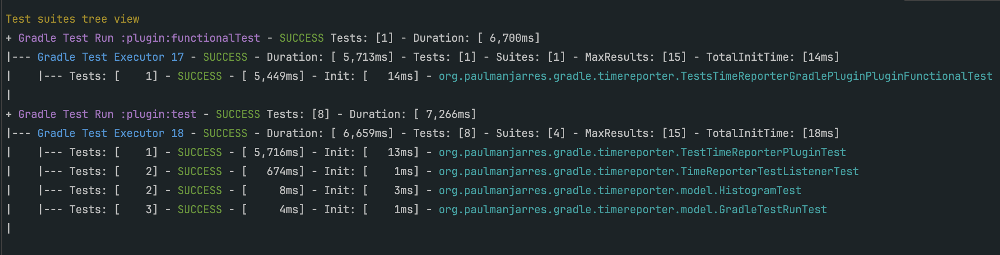
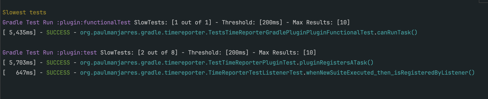
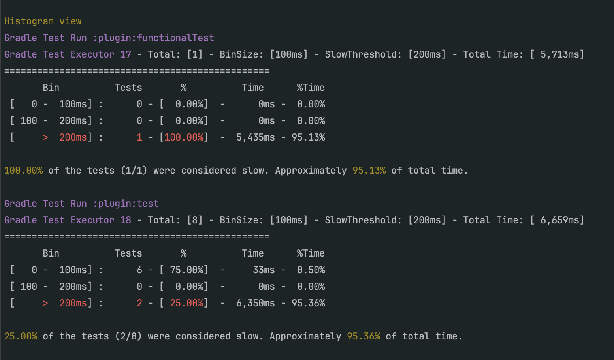

# Tests Time Stats Reporter Gradle Plugin


## Description
This is a simple Gradle plugin that reports tests execution time statistics of your project.

* Works with gradle 6.9+ and Java8+. 
* Total test count.
* Distribution of tests by result (success, failure, skipped)
* Distribution of tests by class (how many tests are in each class)
* Histogram with test count distribution per bins.
* Top N of slowest tests (configurable).

See the Gradle Plugins page: https://plugins.gradle.org/plugin/io.github.paul-manjarres.test-time-reporter

The plugin is inspired in the Karma Time Stats Reporter plugin (https://www.npmjs.com/package/karma-time-stats-reporter)


## Use in your Project

In your build.gradle:

```kotlin
plugins {
    id("io.github.paul-manjarres.test-time-reporter") version "0.12"
}

// These are the default values, can be omitted if it works for you
testTimeReporter{
    enabled = true                   // Enabled / disables the plugin output. 
    longestTestsCount = 5            // The max amount of results to show in the slowest test section. 
    maxResultsForGroupByClass = 5    // The max amount of results to show in the group-by-class test section.
    maxResultsForTreeViewSuites = 15 // The max amount of results of suites to show in the tree view
    binSizeInMillis = 100            // Size of each bin in the histogram
    slowThresholdInMillis = 200      // The threshold to consider a test as 'slow'
    showGroupByClass = true          // Enables/disables test grouped by class section
    showGroupByResult = true         // Enables/disables test grouped by result section
    showSkipped = true               // Shows the skipped test names under the Results view.
    showFailed = true                // Shows the failed test names under the Results view.
    showSlowestTests = true          // Enables/disables slowest test section
    showTreeView = true              // Enables/disables slowest test section
    showHistogram = true             // Enables/disables histogram section
    coloredOutput = true             // If true, output will use colors.
}
```

### Views

The project will output different views with data about your tests:
* Results View : A high level view of the results of the tests. Shows how many are SUCCESS, SKIPPED, FAILURES, percentages. 
* Tree View: A detailed view about the tests structure, gradle executors and test suites. Number of tests, total suite time, init time.  
* Slowest Tests: Shows the Top N slowest tests among all the test suites. 
* Histogram View: Shows a simple histogram with data about the distribution of tests based on the execution time. 

### Screenshots







